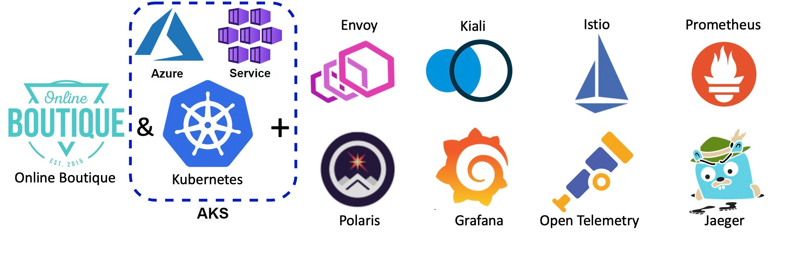

# Microservices on cloud-based Kubernetes - Azure


[](https://opensource.org/licenses/Apache-2.0)

### Introduction

Inspired by the Original Project: <https://github.com/didier-durand/microservices-on-cloud-kubernetes>

This is an implementation of the same micro-services pattern deployment lab implemented with Azure Kubernetes Services. 

(see [Credits](#credits) Section for more information).

> The purpose of this repository is to provide the fully automated setup of a nice-looking (see [screenshots](https://github.com/GoogleCloudPlatform/microservices-demo#screenshots)) 
showcase / testbed for a cloud-native ([precisely defined](https://docs.microsoft.com/en-us/dotnet/architecture/cloud-native/definition) application
by Microsoft) on a cloud-hosted Kubernetes cluster (here [GKE by Google Cloud](https://cloud.google.com/kubernetes-engine)) based on an interesting [service mesh](https://www.redhat.com/en/topics/microservices/what-is-a-service-mesh). 
So, additionally, the setup will install tooling (coming from the [CNCF Cloud Trail Map](https://github.com/cncf/trailmap) for many of them) to make the application and its service mesh observable and manageable.

> Another goal of this repository is to help people exploring the cloud-native architecture: when you fork it, you rapidly get a working cluster with a somewhat 
"real-life" application and decent tooling to experiment with, without the need for a long trial-and-error process starting with infrastructure to set it 
up from scratch. It makes it much faster to grasp the philosophy of the distributed architecture proposed by Kubernetes.

#### My Purpose for the AKS / Cloud Kubernetes Lab

My Purpose was to create an Cloud Native Kubernetes Lab, for Operations, DevOps and Site Reliability Engineering Perspective.

One of the main problem for training complex infrastructure scenarios is that, it's not always possible to have an application workload to work with that can simulate real life scenarios, or close to a production workload in terms of complexity. 

My purpose with this repository is to have a baseline for quick and fast start with a function Azure Kubernetes Lab. 

Then use the infrastructure to work on more advanced DevOps concepts. 

Some improvements I can think of right now:  
1- Learn and Practice with the Observability and Monitoring Tools  
2- Practice IaC and Pipeline Concepts, (GitHub Action provided here is not a good reference for proper CI/CD, they are quick and easy methods to keep everything  contained to a GitHub Repository)
3- Practice Kubernetes Cluster Administration Operations, Upgrade Cluster Version, Scale-up, Scale-Out  
4- Setup Advanced Networking for Ingress. Currently project used unprotected HTTP protocol, having the traffic secured via SSL can be an improvement.  
5- Practice, more advanced load testing, stress testing and reliability testing (chaos monkey).  
6- Learn how to co-host multiple team's operations on a single AKS cluster (developing different services) using AKS Dev Spaces and Kubernetes namespaces in general.
7- Build the application services from source, and customize them to integrate with Azure Application Insights for APM and Telemetry Logging.  

## Access to deployed tools & dashboards

_**Available dashboards:**__

(click on pictures to enlarge them - also use the hyperlinks provided with each dashboard description to have a good overview of the 
features of each tool from its official documentation

1. ~~**Standard K8s UI**: our workflow deploys first [this standard Kubernetes dashboard](https://kubernetes.io/docs/tasks/access-application-cluster/web-ui-dashboard/) 
as a tool that should anyway be included in any installation. It gives a good overview of the deployed cluster with static (configuration) and dynamic (metrics) information 
about the active objects. When *`kubectl proxy`* is active, the dashboard is available at [this url](http://localhost:8001/api/v1/namespaces/kubernetes-dashboard/services/https:kubernetes-dashboard:/proxy/). 
The security check at login is most easily satisfied by selection the login option of config file (see Prereqs to obtain it in Setup section).~~ 


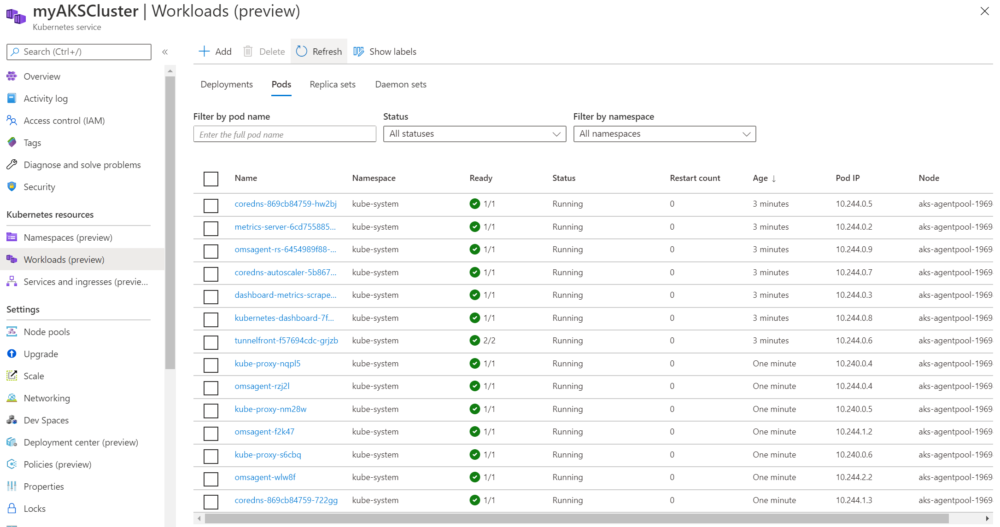
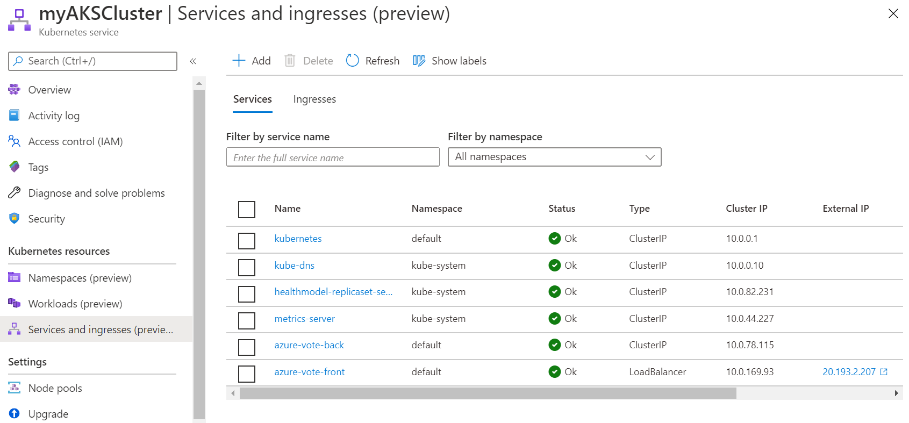
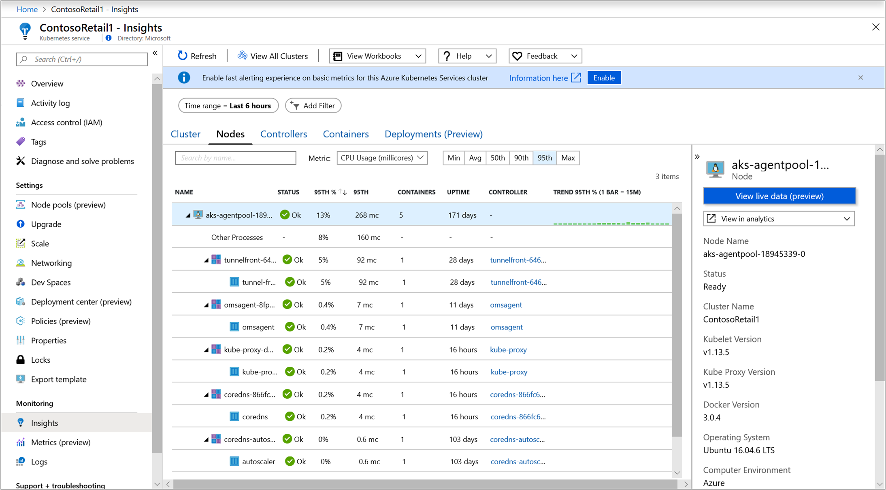
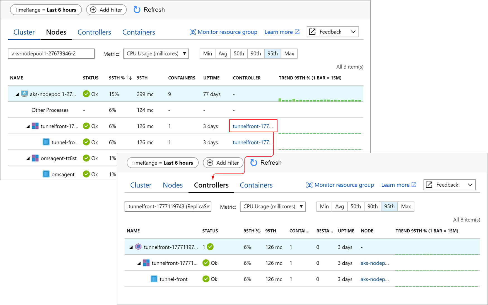

1. **Azure Portal & Azure Container Insights Solution**
As per Azure [Documentation](https://docs.microsoft.com/en-us/azure/aks/kubernetes-dashboard) Kubernetes Dashboard is soon to be deprecated and recommended solution is to use Azure Container Insights Solution which brings, the management plane visibility to cloud providers operations tools.  
This gives a better controls(in terms of access and security) and operations capability to the cluster operators.  
My implementation, deploy Azure Container Insights Monitoring Solution with the ARM template. ARM templates, is considered Infrasructure as Code and includes can include it's own workflow logic.  
Hence, the template deployment flow looks like below:
1- Deploys a Log Analytics Workspace
2- Deploy the Azure Kubernetes Cluster, with Monitoring Add-On enabled.
3- Deploys the Container Insights Management Solution to Log Analytics Workspace, created in step1. 


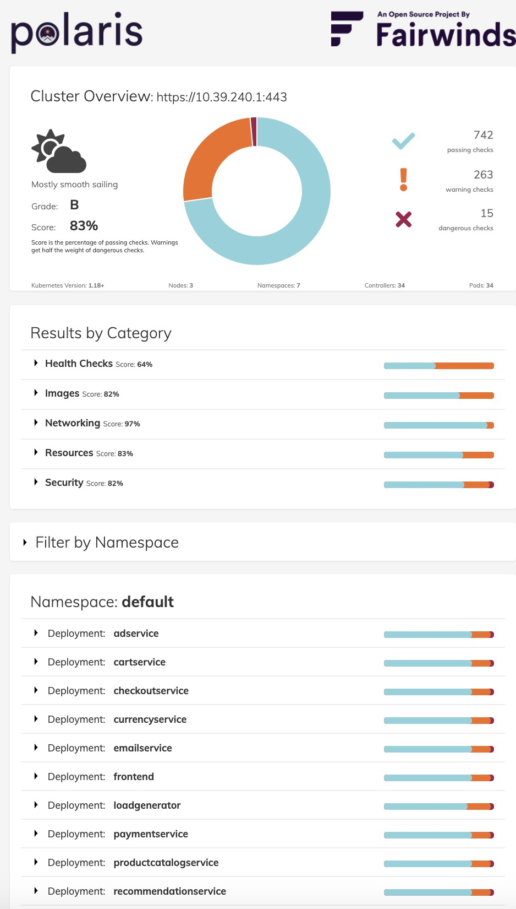

2. **Polaris dashboard**: [Polaris](https://github.com/FairwindsOps/polaris) is an interesting tool, even in its OSS version (the paid-for version 
provides more checks) used here. After installation, it [scans the definitions](https://www.fairwinds.com/polaris) of various kinds of objects and applies sanity checking rules to 
validate their proper configuration. For example, in the case of Online Boutique, it will warn that containers have no resource constraints (cpu, 
memory, etc.) imposed on them or that their security credentials are too wide compared to what they do. The hyperlinks provided on the unsatisfactory 
checks document the reason(s) of the alert as well as the possible remedies to apply. So, a quite useful tool to incrementally increase the quality of the 
configuration of a given cluster: new versions of yaml object manifests can be gradually deployed to minimize the issue notifications.

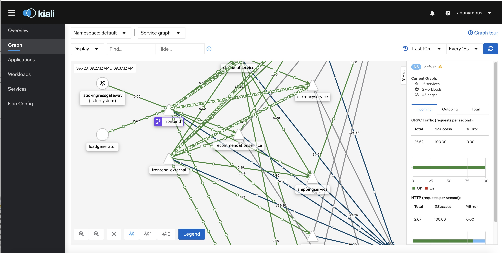

3. **Kiali Dashboard**: [Kiali](https://kiali.io/) claims itself the *"Service mesh management for Istio"*. it allows an interactive discovery of 
 the defined relations between the services. Then, it provides [detailed insights and metrics](https://kiali.io/documentation/latest/features/) about the 
 health of those services and the requests between them.  The live traffic animation in the UI is extremely useful: it allows to spot very quickly 
 where the activity happens to focus on those hot spots during root cause analysis for an issue. You can also go back in time with the replay 
 feature to see the traffic and the interactions that happened in the past to understand why and how you reached current situation. This dashboard 
 is accessed via *`istioctl dashboard kiali`* that will open the corresponding UI into your web browser.

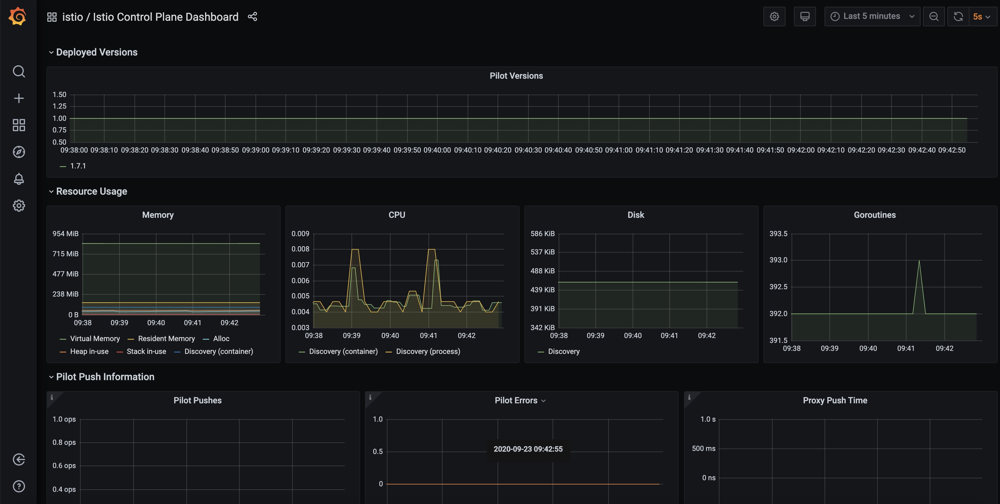

4. **Grafana dashboard**: [Grafana](https://grafana.com/oss/grafana/) which *`allows you to query, visualize, alert on metrics and logs, no 
 matter where they are stored`* provides very nice charts about the activity of the cluster as the whole (usual metrics about resource consumption: 
 cpu, memory, etc. for nodes. But, more specifically in this context it provides interesting additional [dashboards specific to the Istio service mesh](https://istio.io/latest/docs/tasks/observability/metrics/using-istio-dashboard/) 
 related to the traffic between the pods. Those dashboards are accessed via *`istioctl dashboard grafana`* that will open the corresponding UI into 
 your web browser.

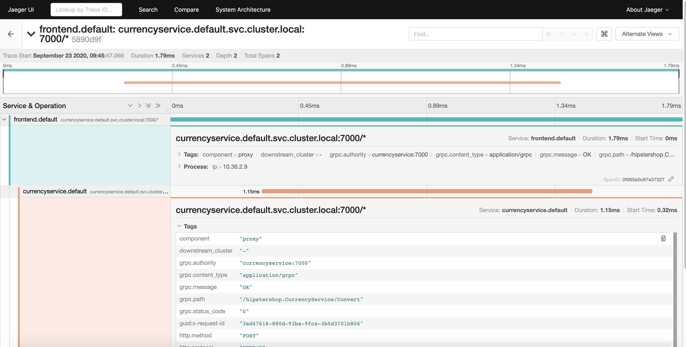

5. **Jaeger dashboard**: the Open Boutique is instrumented via [OpenCensus](https://opencensus.io/), now merged into 
[OpenTelemetry](https://opentelemetry.io/), component of the CNCF Cloud Trail Map. Jaeger - in CNCF Cloud Trail Map - is the tracing backend 
implemented here. It centralizes and ingests the distributed traces produced by the various microservices. So, the Jaeger dashboard will allow the 
detailed examination of those aggregated distributed traces also known as ["spans"](https://opentracing.io/docs/overview/spans/#what-is-a-span). This 
dashboard is accessed via *`istioctl dashboard jaeger`* that will open the corresponding UI into your web browser.
 
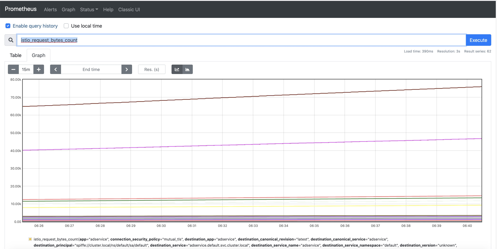
 
6. **Prometheus dashboard**: [Prometheus](https://prometheus.io/) (also member of CNCF Cloud Trail Map) is the cornerstone component for metrics 
collection. The collected data is used by Grafana, Kiali & Jaeger for their specific purposes. The Prometheus dashboard can be used as the "source 
of truth": for example, it can be used to verify if some metrics claimed as missing by a downstream component using this value is really collected 
or not and to compare the graph produced by Prometheus itself to the graph produced downstream user to spot potential discrepancies. This dashboard 
is accessed via *`istioctl dashboard prometheus`* that will open the corresponding UI into your web browser.

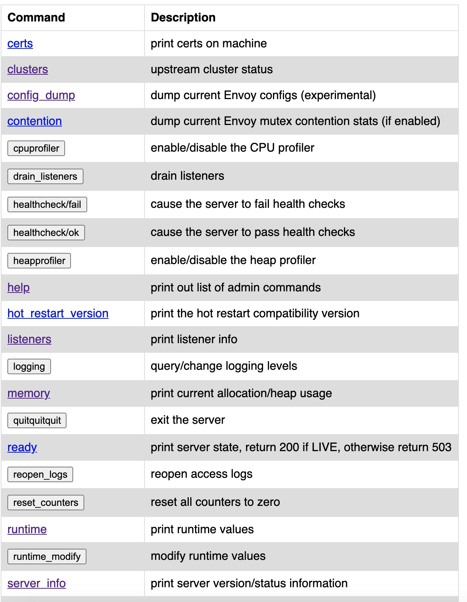

7. **Envoy dashboard**: an improved version of [Envoy Proxy](https://www.envoyproxy.io/docs/envoy/latest/intro/what_is_envoy), also part of the CNCF Cloud Trail Map,  is the [sidecar
  container](https://istio.io/latest/docs/concepts/what-is-istio/#why-use-istio) used by Istio. Envoy provides a (somewhat rough) dashboard to go into the 
  nitty-gritty details of a given pod: it is usually used for low-level introspection into the traffic between pods in unexpected situations. It is 
  more a debugging tool at very low-level: most cluster administrators shouldn't need to use it. This dashboard is accessed via *`istioctl 
  dashboard envoy podname[.namespace]`*: it will open the corresponding UI for the chosen pod sidecar into your web browser.
   
## Workflow steps

The workflow has following steps:


1. checkout of project artefacts
2. Install Istioctl to the agent
3. Login to Azure Context and Install Tools Az Cli and Az Pwsh(subsequent steps in shell script)
5. Deploy Infrastructure, which includes the Azure side Monitoring Infra and Integration
6. import cluster config & credentials for kubectl & istioctl
7. deploy Polaris dashboard and check its proper deployment
9. deploy Istio and check its proper deployment
10. deploy Istio-based addons and check their proper deployment
11. label application namespace to ensure automatic sidecar injection (see [Istio architecture](https://istio.io/latest/docs/ops/deployment/architecture/) uses an improved version of Envoy for sidecars) in microservice pods
12. ~~deploy proper application manifests for Istio~~ **Not need for Azure**
13. deploy Online Boutique and check its proper deployment
14. run kubectl get all to display all deployed assets and IP address information

Application can now be accessed as described below.


### AKS Lab Demo User Snippets

You can start using your lab via instructions below.

#### Setup Project Resource Names

```powershell
#Curate Variables
$ResourceGroupName = "mert-lab-aks-aue01"  #Update with your RG Name
$AksClusterName = "mertlabaue01-aks" #Update with your AKS Lab Cluster Name
```

#### Get your Kubectl Credentials
```powershell
Import-AzAksCredential -ResourceGroupName $ResourceGroupName -Name $AksClusterName -Force
```

#### Get All Objects in Kubernetes Cluster

```console
kubectl get all
```

#### Find the IP Address of the Online Boutique FrontEnd

```powershell
$FrontEndService = kubectl get service/frontend-external -o=json | ConvertFrom-Json -Depth 100
$FrontEndServiceUri = "http://{0}" -f $FrontEndService.status.loadBalancer.ingress.ip

Write-Output "Online Boutique FrontEnd Uri: $FrontEndServiceUri"
```

```console
Online Boutique FrontEnd Uri: http://52.147.9.72
```

#### Get Logs from Load Generator

```console
kubectl logs -l app=loadgenerator -c main
 GET /product/66VCHSJNUP                                          600     0(0.00%)      77      34    1048  |      41    0.10    0.00
 GET /product/6E92ZMYYFZ                                          563     0(0.00%)      77      34    1763  |      41    0.00    0.00
 GET /product/9SIQT8TOJO                                          593     0(0.00%)      73      34    1013  |      41    0.30    0.00
 GET /product/L9ECAV7KIM                                          631     0(0.00%)      82      34    1349  |      42    0.20    0.00
 GET /product/LS4PSXUNUM                                          608     0(0.00%)      83      34     896  |      42    0.20    0.00
 GET /product/OLJCESPC7Z                                          623     0(0.00%)      69      34    1079  |      41    0.10    0.00
 POST /setCurrency                                                808     0(0.00%)      82      44    1089  |      51    0.20    0.00
--------------------------------------------------------------------------------------------------------------------------------------------
 Aggregated                                                      9517     0(0.00%)                                       1.80    0.00
```


### Credits

Inspired by the Original Project: <https://github.com/didier-durand/microservices-on-cloud-kubernetes>

This is an implementation of the same micro-services pattern deployment lab implemented with Azure Kubernetes Services. 

To read his full README and instructions click [here](https://github.com/didier-durand/microservices-on-cloud-kubernetes). I will be moving relevant parts to this repo and update with new instructions, specific to our implementation.

### License 

Below is [Didier](https://github.com/didier-durand)'s License notice, and I'm carrying over the same LICENSE, so you are also free to re-use the resources in the repository.

> This application, licensed under Apache terms (same terms for all components used in this worklfow - So, allowing free reuse) is the ["Online Boutique"](https://github.com/GoogleCloudPlatform/microservices-demo)
 (formerly known as Hipster Shop - developed by a Google team but not an official product of them). It is composed of 10 polyglot microservices behind a nice-looking web frontend calling them to serve client requests. 
 A load-generator - part of the package - will generate traffic while the application is running to make use of tools (Prometheus, OpenTelemetry, 
 etc.) more attractive.

 ## Application features & service mesh

<p align="center"></p>
<p align="center"><ins>application service mesh<ins></p>


This demo application contains an interesting service mesh to give some substance to demos and tests: its schema is given above. This mesh 
which is thoroughly used by a traffic generator - also part of the demo package - which generates constant solid traffic to make the implementation 
of monitoring tools.

Interesting points of Online Boutique:

1. **Multi-language:** the microservices corresponding to the various application features were on purpose written on purpose by the authors in 
numerous languages (Go, NodeJS, Java, C#, Python) to demonstrate a key strength of container-based applications: many microservices collaborate in 
a "polyglot" environment where each team (or individual) can program in its language of choice while ad hoc frameworks for each language make sure 
that all Kubernetes standards (probes, etc.) and architecture can be easily respected with minimal effort to obtain a coherent and compliant global 
system, manageable by the standard palette of Kubernetes tools. This polyglot aspect is reinforced by the mixed use of http and gRpc, which are both
 understood by the monitoring tools.
 
2. **Service Mesh:** the application graph shows relationships between the various services and the front-end. Indeed, the application 
is made of13 pods. This high-level of granularity is the accepted Kubernetes pattern for application architecture: it brings numerous advantages like continuous 
delivery, exhaustive unit testing, higher resilience, optimal scalability, etc. But, it also requires the use of a thorough set of tools to 
maximize the observability of the system. If "divide and conquer" is the motto of cloud-native architectures, the motto of their operations is probably 
"observe to sustain": when working with Kubernetes application, one feels very quickly the need for (very) solid tools monitoring automatically 
the myriad of objects (services, pods, ingress, volumes, etc.) composing the system.  

3. **GCP Tooling:** the application is instrumented for [Stackdriver (profiling, logging, debugging)](https://en.wikipedia.org/wiki/Stackdriver). So, 
the source code of this application provides the right guidance to see how to code in order to obtain the right leverage on tools directly available 
from the GCP service portfolio.

## Setup for forks

To start with, you need an active Azure account that you can use the providers required for this project, like Kubernetes and Azure Monitor.

Then, fork our repository and define the required [Github Secrets](https://docs.github.com/en/actions/reference/encrypted-secrets) in your forked 
repository:

All you need for this project is to setup one secret called **"AZURE_CREDENTIALS"**. 
Open the run the powershell script **'New-AzAksLabPrerequisites.ps1'** you can find [here](/ps1/tools/New-AzAksLabPrerequisites.ps1)

This script will create a Service principal, save the credential json file to your local as **"AZURE_CREDENTIALS.json"** and also create a new environment variable called **"AZURE_CREDENTIALS"** in your local system. 

This local environment variable part is optional, but it makes it easier for you to also run the scripts locally, without using github actions. 

Once you have the json file generated, copy and paste the contents of that file as your **"AZURE_CREDENTIALS"** Github Repository Secret.

To easily launch the workflow, you can launch it with the [manual dispatch feature of Github](https://github.blog/changelog/2020-07-06-github-actions-manual-triggers-with-workflow_dispatch/) that you can see as a launch button in the Action tab of your project for 
the **"Deploy AKS Lab Infra and Services"** workflow. Similarly, you can stop it via similar button in **"Clean-Up AKS Lab Resources"** workflow.

If you already have deployed the Infrastructure but something went wrong during services installation you can run **"Deploy AKS Lab Services Only"** to skip Infrastructure deployment and directly go to service deployment.

When the deployment workflow completes successfully, you should be able to access the Online Boutique from anywhere on the Internet at the pubic IP 
address displayed in the final lines of step "Deploy AKS Lab Infra and Services" 

To get access to the cluster via kubectl see [above](#AKS-Lab-Demo-User-Snippets)

Finally, you should [install kubectl](https://kubernetes.io/docs/tasks/tools/install-kubectl/) and 
[install istioctl](https://istio.io/latest/docs/setup/install/istioctl/) if not present on your laptop yet.

To install these on a Windows laptop, I've left a [script](/ps1/tools/Install-ToolsOnWindows.ps1) **'Install-ToolsOnWindows.ps1'** with snippets inside to show you how to install istioctl and kubectl on a Windows machine. 
They are both stand-alone executables so there are many ways to install them.
